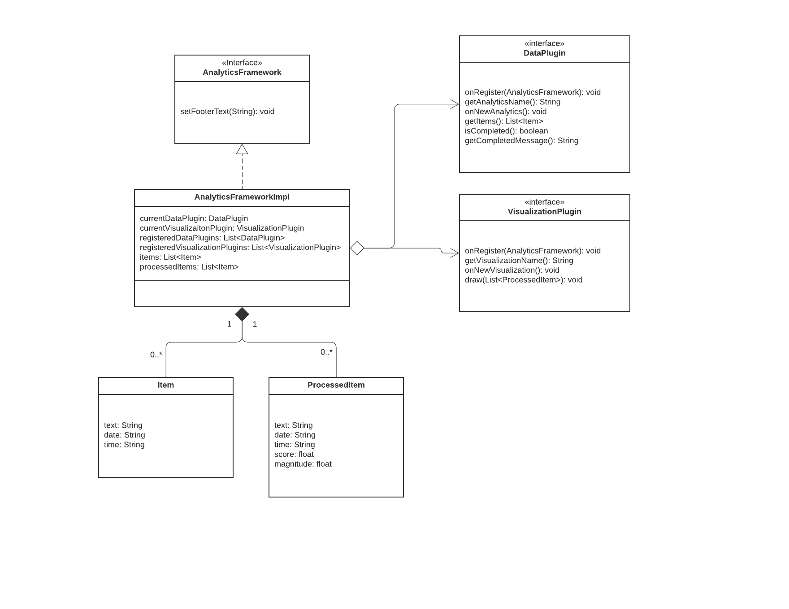
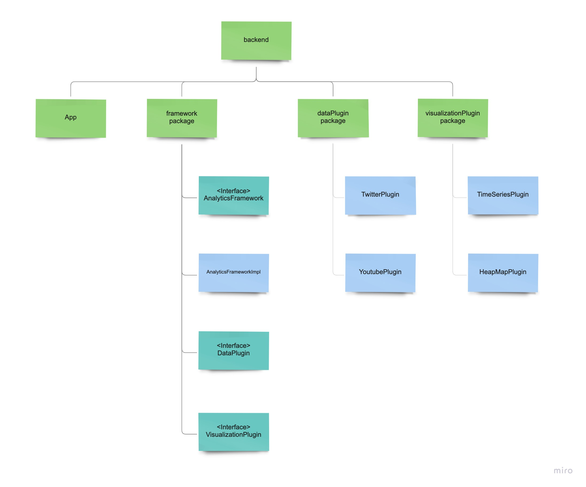

## Design ##
### Domain ###
The goal of this project is to perform sentiment analysis on texts from different sources and visualize the outputs in different ways. Sentiment analysis is a natural language processing (NLP) technique used to determine whether data is positive, negative, or neutral. Data plugins provide texts from different sources for the framework to process, while visualization plugins display the process results in multiple ways.   
  
Our data plugins initially include the following, and adding more plugins is allowable:  
* A Twitter plugin that takes in a generic feed of Twitter messages, or a user's Twitter messages using their handle with the Twitter API
* A Youtube plugin that takes in all reviews of  organizations on Google map with the Google review API

The framework uses Google's Natural Language API to perform sentiment analysis.  
Input: lists of text fragments with corresponding time stamps.  
Output: lists of text fragments with corresponding timestamps, sentiment scores, and sentiment magnitudes.  
  
Our visualization plugins initially include the following, and adding more plugins is allowable:
1. Time-series graph  
Input:  lists of text fragments with corresponding timestamps, sentiment scores, and sentiment magnitudes.  
Output: scatter plots/line charts, showing the change of sentiment scores over time  
2. Heat map  
Input:  lists of text fragments with corresponding timestamps, sentiment scores, and sentiment magnitudes.  
Output: Heat map displaying the sentiment magnitudes and time   
  
### Generality vs specificity ### 
1. Key abstractions   
Key objects: Item, ProcessedItem  
The UML diagram is shown below.  

  
2. Reusable functionality  
* The framework performs the sentiment analysis, hence providing benefits for reuse. All plugins could share the same framework to process data, specifically, to do sentiment analysis on texts. 
* When adding a new data plugin to provide data from a new source, it would be able to use all existing visualization plugins to visualize the results. 
* When providing another visualization plugin to display the results in a new way, it would be able to use data extracted from all existing data plugins. 
* All plugins use the same user interface. Clients use a single GUI to choose all existing data plugins, visualization plugins, and plugins that may be added in the future.
  
3. Potential flexibility of Plugins
   
Data plugins:  
* The data source could be local files, web pages, web APIs
* Data could be any text data with timestamps 
* Adding a new data plugin wouldn’t influence the framework and other plugins
  
Visualization plugins:  
* The visualizations could be graphs or tables, such as maps, pie charts, bar charts, histograms, statistical abstracts, X-Y plots, scatter plots, bubble charts, choropleths, etc. 
* The visualization could use all kinds of libraries, like ECharts-Java, Plotly, C3, Chart.js, or Kartograph 
* Adding a new visualization plugin wouldn’t influence the framework and other plugins

### Project structure ###
The analyticsFramework interface, an implementation of the analyticsFramework, dataPlugin interface and visualizationPlugin interface are located in the framework package/directory. More specifically, the dataPlugin and visualizationPlugin instances can interact with the analytics framework by the analyticsFramework interface. The data plug-ins and visualization plug-ins must implement the dataPlugin and visualizationPlugin interface respectively in order to be registered with the framework. The implementation of dataInput, sentimentAnalysis, and dataOutput are located in the dataProcess package/directory.  
  
Two example data plug-ins, “twitterPlugin” and “youtubePlugin” are implemented in the dataPlugin package/directory. Another two example visualization plug-ins, “timeSeriesPlugin” and “heapMapPlugin” are implemented in the visualizationPlugin package/directory.  
  
The plug-ins loader is implemented in the App.java file, which behaves as the project driver. The data and visualization plugins are loaded by ServiceLoader, which separately loads plugins listed in the META-INF/services/com.andrewgrey.framework.dataPlugin and META-INF/services/com.andrewgrey.framework.visulizationPlugin.  
  
Please refer to the project structure diagram shown below.  


### Plugin interfaces ###
#### 1. DataPlugin ####
Should implement the following methods:

```
void onRegister(AnalyticsFramework framework);
```
Description:   
Called (only once) when the plug-in is first registered with the
framework, giving the plug-in a chance to perform any initial set-up
before the analytics has begun (if necessary).
@param framework The {@link AnalyticsFramework} instance with which the
plug-in was registered.

```
String getAnalyticsName();
```
Description:    
Gets the name of the plug-in analytics. @return analytics name.

```
void onNewAnalytics();
```
Description:    
Called when a new analytics process is about to begin.

```
List<Item> getItems();
```
Description:    
Gets a list of items of the plug-in analytics. The plug-in analytics should convert any data source to
a defined data structure - Item.   
@return a list of items.

```
boolean isCompleted();
```
Description:    
Returns true if the analytics is over. Returns false otherwise.

```
String getCompletedMessage();
```
Description:    
Returns the message to display when the analytics is over.

#### 2. VisualizationPlugin ####
Should implement the following methods:

```
void onRegister(AnalyticsFramework framework);
```
Description:    
Called (only once) when the plug-in is first registered with the framework, giving the plug-in a chance to perform any initial set-up
before the analytics has begun (if necessary). @param framework The {@link AnalyticsFramework} instance with which the
plug-in was registered.

```
String getVisualizationName();
```
Description:    
Gets the name of the plug-in visualization. @return analytics name.

```
void onNewVisualization();
```
Description:    
Called when a new visualization process is about to begin.

```
String draw(List<ProcessedItem> processedItems);
```
Description:    
Performs data visualization display. @param processedItems The list of {@link ProcessedItem} instances from which the plug-in draw visualization.


#### Data Input ####
The data plugin should convert input data into Item object by creating a new Item instance:
```
Item(String text, String date, String time)
```

#### Data Output ####
The visualization plugin should perform visualization using ProcessedItem:
```
ProcessedItem(String text, String date, String time, float score, float magnitude)
```
  


